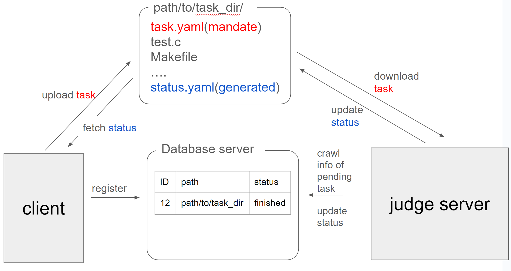

# dsa-judge-server
## 背景・目的
プログラム課題のチェックを自動化するためのジャッジサーバーを作成する。

## 要件
* クライアント(Dockerコンテナ)がホストの`path/to/task_dir/`にタスクに必要なファイルをアップロードし、データベースサーバーにそのタスクの情報を登録する。このとき、登録したタスク情報のステータスは`submitted`とする。定期的にジャッジサーバーがデータベースサーバーに問い合わせ、ステータスが`submitted`のタスクを取得し、`pending`に変更する。ジャッジサーバーは、`path/to/task_dir/`にアップロードされたファイルを取得し、タスクを実行する。タスクの実行が完了したら、データベースサーバーにそのタスクの結果を登録する。このとき、登録したタスク情報のステータスは`completed`とする。


* `path/to/task_dir/`には、以下のファイルが格納されている。
  * (必須)`task.yaml`: タスクの情報が記録されている
  * (自動生成される)`status.yaml`: タスクの実行状況が記録されている
  * その他のファイル: ソースコード、テストケースなど

* `task.yaml`には、実行すべきジョブの情報が記録されている。ジョブの情報とは、以下のようなものである。なお、実行するプログラムは一つで、引数は固定であるとする。
  * ソースコードの相対パス
  * ソースコードの言語
  * ビルドコマンド
  * プログラム名
  * 引数リスト
  * グローバルな制限時間 (ms)
  * グローバルな制限メモリ (MB)
  * テストケースのエントリ(複数あり)
    * 標準入力に流す入力ファイルの相対パス (e.g., `test00.in`)
    * 想定される標準出力のファイルの相対パス (e.g., `test00.out`)
    * 想定される標準エラー出力のファイルの相対パス (e.g., `test00.err`)
    * 出力のチェッカー
      * `standard`: 標準出力と想定される出力が完全に一致すること(**最初はこれだけ実装**)
      * `easy`: 標準出力と想定される出力が完全に一致すること。ただし、空白・改行文字は無視する
      * ``[`float`, precision]``: 標準出力と想定される出力が完全に一致すること。ただし、浮動小数点数の比較を行い、その誤差が`precision`以下であること
      * ``[`line`, `checker`]``: 各行について、`checker`でチェックを行う
    * 想定される終了コード (e.g., 0)
```yaml
source: "src/main.c"
language: "c"
build: "gcc -o main src/main.c"
program: "main"
args: []
timeMs: 1000
memoryMB: 256
testcases:
  - input: "test00.in"
    output: "test00.out"
    error: "test00.err"
    checker: "standard"
    exitCode: 0
  - input: "test01.in"
    output: "test01.out"
    error: "test01.err"
    checker: "easy"
    exitCode: 0
```

* サーバは、タスクの実行状況を`status.yaml`で返す。`status.yaml`は以下のような形式である。
```yaml
status: "running"
progress: 0.5
result:
  test00:
    status: "AC"
    timeMs: 100
    memoryMB: 256
    stdout: "Hello, World!\n"
    stderr: ""
  test01:
    status: "running"
```
  * `status`: タスクの状態。`running`, `completed`のいずれか
  * `progress`: タスクの進捗度。0.0から1.0の間の実数
  * `result`: テストケースごとの結果。テストケースのエントリがキーである。テストケースの結果は以下のような形式である。
    * `status`: テストケースの結果。`AC`, `WA`, `RE`, `TLE`, `MLE`のいずれか
    * `timeMs`: 実行時間 (ms)
    * `memoryMB`: メモリ消費量 (MB)
    * `stdout`: 標準出力
    * `stderr`: 標準エラー出力

## 設計
judgeサーバーはDockerコンテナで動かす。クライアントが登録したタスクを元に、judgeサーバーが
コンパイル・実行用のsandboxコンテナを生成し、その中でコンパイル・実行を行う。
sandboxコンテナ生成は、ホストのDockerデーモンを利用する。

プログラムのビルド・実行などは、以下のような手順で行う。
1. Dockerボリュームを作成し、クライアントがアップロードしたファイルをコピーする
2. サンドボックスコンテナを`docker create`で生成し、ボリュームをマウントする。この際、実行する
    コマンドも指定する
3. サンドボックスコンテナを`docker start -i`で起動する。標準入出力を受け取るた
    め、`-i`オプションを付ける

制限時間のチェックは'docker start'コマンドを実行する関数にタイムアウトを設定する
ことで行う。メモリ消費量・プロセス数・ディスク消費量の制限は、`docker create`す
るときにリソース制限コマンド(cgroupsやulimitが用いられている)を用いて行う。

参考: https://imoz.jp/note/onlinejudge.html

参考: https://github.com/yosupo06/library-checker-judge

## 代替案
[参考資料](https://imoz.jp/note/onlinejudge.html)より、

> ### ジャッジシステムへの攻撃手法とその対処法
> ジャッジシステムはいかなるプログラムをコンパイル・実行してもシステムダウンしてしまってはいけません．そこで，ユーザプログラムに対して監視を行い，システムに危険が及ぶような状況になった場合は実行を停止しなければなりません．近年の国際情報オリンピックで用いられているジャッジシステム MOE は ptrace を用いてユーザプログラムを監視します．しかし，ptrace を用いると各々のシステムコールに対してどのような動作をするか決定しなければならず，また介入を行う必要が発生するために速度の低下も招きます．Imo Judge では出来る限りユーザプログラムを通常の状態に近い状態で実行するため ptrace は用いず，カーネルレベルで処理を行う ulimit や cgroups を用いてユーザプログラムの制限を行います．
> ### メモリを食いつぶす攻撃手法
> ヒープメモリを多量に確保する攻撃手法です．多量のスワップが発生しそれらの影響でジャッジサーバの動作が不安定になることがあります．ulimit ではメモリの制限ができないため cgroups を用いてメモリの制限を行います．制限をかける対象は Virtual Memory ではなく Resident Memory である必要があります．特に Java を実行する場合は Virtual Memory に対して制限をかけた場合，起動さえしない場合があるので注意が必要です．
> ### ディスクを食いつぶす攻撃手法
> ディスク書き込みをし続けることによりディスクの残容量を少なくする攻撃手法です．ジャッジサーバで予期せぬエラーを発生させる場合があるので，ulimit を用いて制限を行います．
> ### fork を用いた攻撃手法
> Fork 爆弾 と呼ばれる攻撃手法です．ulimit を用いてプロセス数の制限を行います．Java は複数のプロセスを生成するため厳しいプロセス制限を行うと Java プログラムを実行することができません．また Fork 爆弾は 1 つずつプロセスを kill しても全て終了させることが (kill している間に次々と新しいプロセスが生成するため) 困難であるので，kill -1 を用いて一掃します．
> ### コンパイルエラーを用いた攻撃手法
> C++ の template は深さ制限がなければチューリング完全であるのでコンパイルが停止しないことがあります．それどころか Warning を履き続けるようなソースコードを作ることも可能であるので，適切にそのような状況があることを考えてコンパイル処理を書かなければなりません．具体的にはコンパイルに時間制限を設け，コンパイルエラーの出力は適切に切り落とす必要があります．
> ### kill を用いた攻撃手法
> ユーザプログラムを監視するプログラムがユーザプログラムと同じ権限で動いている場合，ユーザプログラムによって kill が成功してしまいます．その時はユーザプログラムによる攻撃なのか，ジャッジプログラムがバグによって終了したのかが判断できません．よって，ジャッジプログラムを別の権限で動かす必要があります．
> ### /tmp, /var/tmp を用いた攻撃手法
> /tmp, /var/tmp にプログラムを書き込むプログラムを送り，次にそれらのファイルを include するプログラムを書くと一見ショートコーディングにできます．初代 Imo Judge では /tmp のみの削除を行なっていたため，iwiwi 先生に /var/tmp に書きこまれ攻撃が成功してしまいました．

DMOJのジャッジサーバーはptraceを用いてプログラムの実行を監視しているが、実装が非常に複雑である。
このプロジェクトでは、dockerの機能を用いてコンテナのリソース制限を行うことで、ジャッジサーバーの実装を簡略化する。

参考: https://knowledge.sakura.ad.jp/5118/

参考: https://docs.docker.jp/v19.03/config/container/resource_constraints.html

## セキュリティ上の懸念
JudgeサーバーのDockerソケットをホストマシンのDocker Engineに接続することで、
コンテナ内からホストのDocker Engineを操作できる。これにより、このJudgeサーバーに
侵入した悪意のあるユーザが、ホストマシン上の全てのコンテナを操作してしまう可能性がある。
これにより、ホストのroot権限を奪われる可能性がある？。

https://speakerdeck.com/narupi/dockerkontenakarahosutofalserootwoqu-ruhua?slide=10

対策としては、このJudgeサーバーのendpointにアクセス制限をかけることが考えられる。

